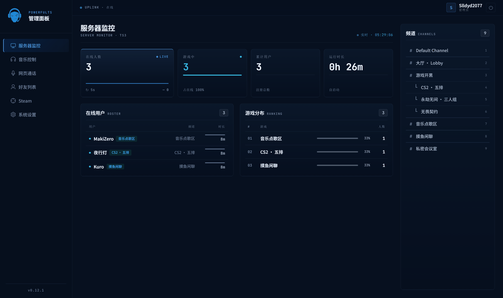
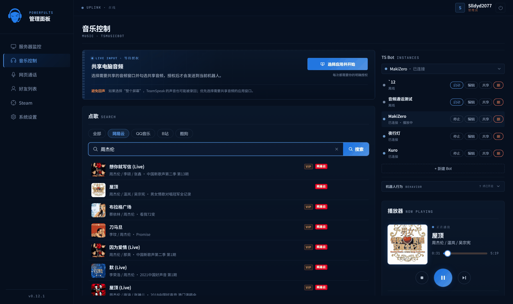
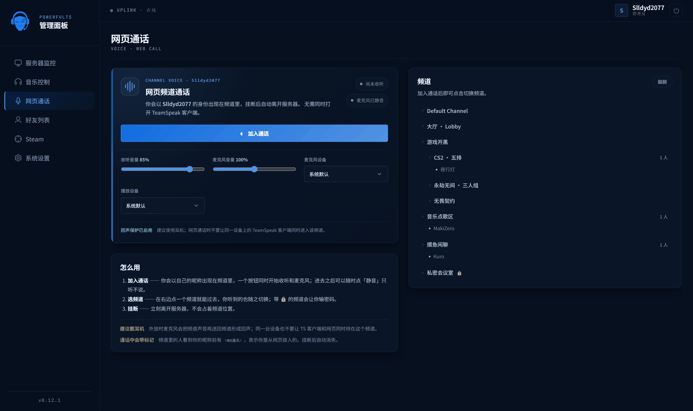
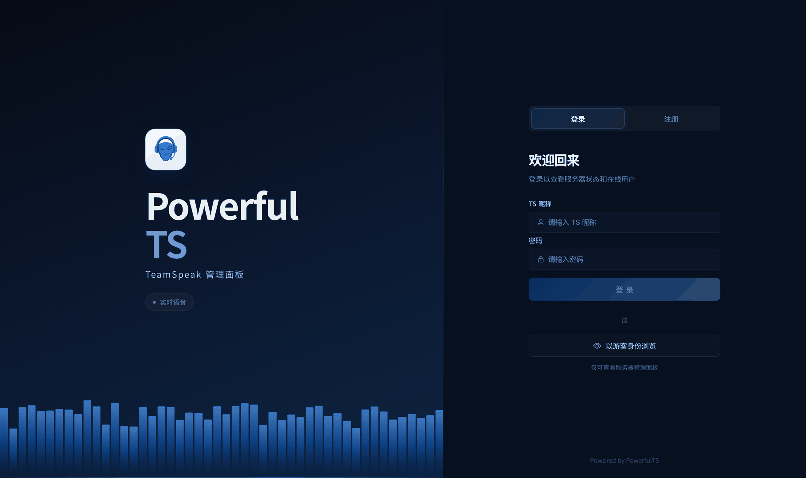
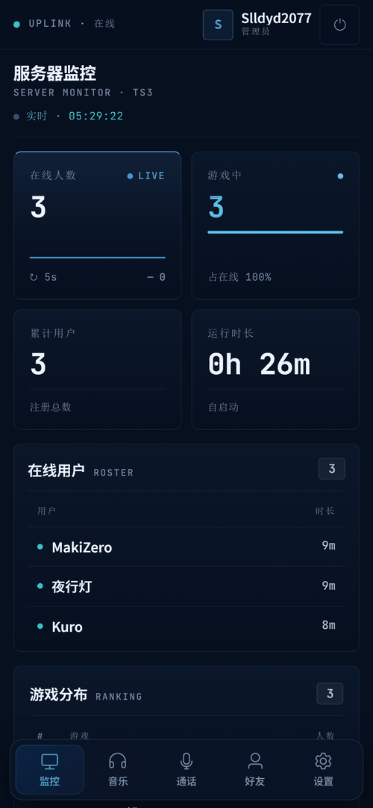
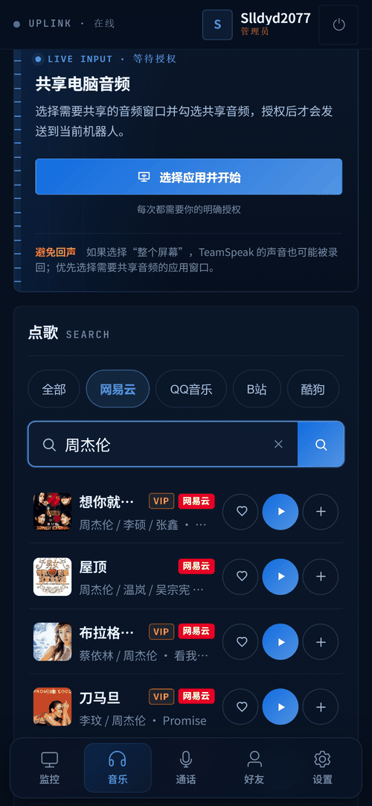
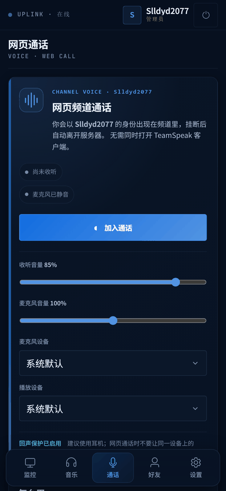

<p align="center">
  
</p>

<p align="center">
  <strong>TeamSpeak 服务器管理面板</strong> · 独立前后端架构 · 原生 TS 直连 + TSMusicBot 音乐引擎
</p>

<p align="center">
  <a href="https://vuejs.org/" target="_blank"></a>
  <a href="https://vite.dev/" target="_blank"></a>
  <a href="https://fastapi.tiangolo.com/" target="_blank"></a>
  <a href="https://www.python.org/" target="_blank"></a>
  
  
  
  <a href="https://github.com/sealdong/napcat-dotnet" target="_blank"></a>
  
</p>

---

## 📖 简介

**PowerfulTS** 是一个面向 TeamSpeak（TS3 / TS6）服务器的 Web 管理面板，采用**前后端分离**架构。
后端原生直连 TS3 ServerQuery 提供服务器数据，并将音乐与点播能力委托给 TSMusicBot 多平台引擎，
让一个 Web 面板即可聚合呈现服务器的在线状态、用户、频道与多媒体能力。

其中**网页通话**让成员不装 TeamSpeak 客户端也能直接在浏览器里收听频道并发言。

> 💡 **跨平台**：提供完整 Docker 化方案，Linux / Windows / macOS / NAS（群晖、威联通等）均可一键部署。

> ⚠️ **早期测试版本**：本项目目前处于**早期开发与测试阶段**，功能仍在快速迭代中，存在诸多 Bug。如遇问题，欢迎[提交 Issue](https://github.com/Slldyd2077/PowerfulTS/issues) 反馈。

---

## ✨ 功能特性

| 模块 | 状态 | 能力 |
|------|:----:|------|
| 👤 账户 | ✅ | 登录 / 注册（QQ + TS 昵称绑定 + 验证码） |
| 🎙️ **网页通话** | ✅ | **不装 TS 客户端，直接在网页收听频道并发言**：以自己的昵称接入、浏览并切换频道（支持频道密码）、按人调节音量、麦克风增益与输入输出设备选择 |
| 👥 在线用户 | ✅ | 昵称 · 游戏 · 所在频道 · 在线时长 · 各游戏人数分布 |
| 📡 频道列表 | ✅ | 频道树浏览 · 各频道在场成员 |
| 🎵 音乐中心 | ✅ | 搜索 · 点歌 · 队列 · 音量 · 播放模式（网易云 / QQ / 酷狗 / B 站） |
| 📡 电脑音频直播 | ✅ | 用户主动选择应用/屏幕并授权后，通过音乐机器人实时共享音频 |
| 🔐 平台账号 | ✅ | 网易云 / QQ / 酷狗 / Bilibili 扫码登录（解锁 VIP 曲库、个人歌单、番剧与视频点播） |
| 🎮 Steam | ✅ | OpenID 绑定 · 好友在线状态 · 共同游戏 · 游戏时长排行；TS 在线列表优先显示 Steam 当前游戏 |
| 📱 QQ通知 | ✅ | 通过 NapCat/OneBot 实现QQ好友上线通知（需配置 NapCat） |
| 🤝 社交 | ✅ | 好友添加 / 删除 / 在线状态 |
| 📱 移动端 | ✅ | 手机 / 平板自适应（抽屉导航 · 响应式布局 · 触屏长按操作） |

> 音乐、点播、社交等功能**需注册账号后使用**；游客会获得两小时临时身份，仅可浏览管理面板和使用网页通话。浏览器会自动在请求头注入会话 Token。

---

## 📸 界面预览

> 以下截图取自一台本地搭建的 **演示 TS3 服务器**（频道与在线成员均为演示数据），并非任何真实服务器的用户信息。

### 服务器监控

在线人数、游戏分布、在线用户列表与频道树，每 5 秒自动刷新。

<p align="center">
  
</p>

### 音乐控制

多平台搜索（网易云 / QQ / 酷狗 / B 站）、播放队列、音量与播放模式，右侧管理多个 TS Bot 实例。

<p align="center">
  
</p>

### 网页通话

不装 TeamSpeak 客户端，直接在浏览器收听频道并发言；右侧可浏览频道与在场成员，带 🔒 的频道需要密码。

<p align="center">
  
</p>

### 登录页

左侧音频频谱随开屏背景音乐律动，支持以游客身份浏览管理面板；进入游客模式时会由服务端分配随机临时昵称，也可直接使用网页通话。

<p align="center">
  
</p>

### 移动端

手机 / 平板自适应：底部标签栏导航、单栏布局、触摸友好的操作按钮。

<p align="center">
  
  
  
</p>

---

## 🧱 技术栈

| 层 | 技术 |
|----|------|
| **前端** | Vue 3 · Vite 8 · Element Plus · Pinia · Vue Router · TypeScript · Axios |
| **后端** | FastAPI · Uvicorn · httpx · SQLAlchemy (async) · aiosqlite · python-dotenv |
| **数据层** | SQLite（默认零依赖文件库，可切 PostgreSQL/MySQL） |
| **部署** | Docker · Docker Compose（跨平台一键部署） |
| **运行时** | Node.js ≥ 18 · Python ≥ 3.11（仅手动部署需要；Docker 已内置） |

---

## 🏗️ 系统架构

PowerfulTS 后端原生直连 TS3 ServerQuery，同时代理 TSMusicBot 的多媒体能力；对前端只暴露 `/api/*` 一个入口。

```
                          ┌──▶ TS3 ServerQuery (:10011)   监控 · 用户 · 频道 · 好友 · 认证（原生直连）
浏览器  ▶  Vue 3 SPA (:5173)  ▶  FastAPI (:8001)  ──┤
          (Vite 代理 /api)     原生数据层 + 代理网关   └──▶ TSMusicBot (:3000)            音乐搜索 · 点歌 · 播放控制 · B 站点播
                                                                 （网易云 / QQ / B 站 多平台 · TS3/TS6 双协议）
```

- `/api/stats`、`/api/channels` → 原生 TS3 ServerQuery（概览 / 频道，直读）
- `/api/auth/*`、`/api/friends/*` → 原生 TS3 ServerQuery + SQLite（认证 / 好友 / 账户）
- `/api/music/*` → TSMusicBot 音乐引擎（搜索 / 播放控制 / 平台账号登录）
- `/api/music/voice/*` → 网页通话（浏览器 ⇄ TSMusicBot 的双向 Opus 中继 + 频道浏览/切换）
- `/api/steam/*` → Steam OpenID 绑定与好友 / 游戏数据
- `/api/bili/*` → Bilibili 浏览与点播（点播由 TSMusicBot 多平台引擎驱动）+ 图片代理

> 监控、认证、社交等模块已由原生 TS3 ServerQuery 直连 + SQLite 数据层实现，不再依赖外部桥接服务。

---

## 📁 项目结构

```
PowerfulTS/
├── assets/                      # 项目 LOGO、banner 与界面截图（screenshots/）
├── backend/                     # FastAPI 后端 — 原生 TS3 直连 + 代理网关
│   ├── app/
│   │   ├── core/config.py           # 配置：从环境变量读取 TSMusicBot / TS3 凭据
│   │   ├── models/                  # SQLAlchemy 模型（账号 / bot 归属 / 歌单 …）
│   │   ├── routers/                 # music(含 voice) / bilibili / monitor / auth / friends / steam / admin
│   │   ├── services/                # TSMusicBot 客户端 · TS3 监控 · 语音中继 · 通话 bot · Steam …
│   │   └── main.py                  # 应用入口（原生数据层 + TS3 监控 + 多媒体代理）
│   ├── tests/                   # 后端测试
│   ├── Dockerfile               # 后端镜像
│   ├── .env.example             # 配置模板（复制为 .env 填写）
│   └── requirements.txt
├── frontend/                    # Vue 3 前端
│   ├── src/
│   │   ├── components/voice/        # 网页通话面板与频道浏览器
│   │   ├── workers/                 # AudioWorklet：抖动缓冲 + 多人混音 + 每人增益
│   │   └── views/                   # 各页面
│   ├── Dockerfile               # 多阶段构建（node 编译 → nginx 托管）
│   ├── nginx.conf               # 静态托管 + /api 反向代理
│   └── vite.config.ts
├── docs/                        # 设计与校验文档
├── docker-compose.yml           # 一键编排（backend + frontend）
└── README.md
```

---

## 🚀 快速开始

### 方式一：Docker 一键部署（推荐）

适用于 Linux 服务器、Windows、macOS、NAS 等所有支持 Docker 的平台。**无需本地安装 Python / Node.js。**

#### 1. 前提条件

- 已安装 [Docker](https://docs.docker.com/get-docker/) 与 [Docker Compose](https://docs.docker.com/compose/install/)（Docker Desktop 自带）
- 上游服务已就绪（见 [🔌 接入上游服务](#-接入上游服务)）：
  - **TSMusicBot**（音乐 / 点播引擎，默认 :3000）
  - **TS3 服务端**（开启 ServerQuery，默认 :10011）

#### 2. 配置环境变量

```bash
cd backend
cp .env.example .env          # Windows PowerShell: copy .env.example .env
```

编辑 `backend/.env`，填入 TSMusicBot 与 TS3 凭据（**关键：容器内地址需特殊配置，见下方说明**）：

```ini
# TSMusicBot 音乐引擎
TSMUSIC_URL=http://host.docker.internal:3000   # ← 容器访问宿主机服务，见下方「容器网络地址」
TSMUSIC_USER=你的TSMusicBot账号
TSMUSIC_PASSWORD=你的TSMusicBot密码
TSMUSIC_BOT_ID=你的bot实例id

# TS3 ServerQuery
TS3_HOST=host.docker.internal                  # ← 同上
TS3_QUERY_PORT=10011
TS3_QUERY_USER=你的ServerQuery账号
TS3_QUERY_PASSWORD=你的ServerQuery密码
TS3_SID=1

# CORS（生产部署改为实际访问域名/端口）
CORS_ORIGINS=http://localhost:8080
```

> **🐳 容器网络地址说明**（Docker 部署必读）
>
> 容器内的 `127.0.0.1` 指向容器自身，**不是宿主机**。因此当 TSMusicBot / TS3 运行在宿主机时：
> - **Windows / macOS（Docker Desktop）**：用 `host.docker.internal`（如上例）。
> - **Linux**：`host.docker.internal` 默认不可用，需改用**宿主机内网 IP**（如 `192.168.1.100`），或在 `docker-compose.yml` 的 backend 服务加 `extra_hosts: ["host.docker.internal:host-gateway"]`。
> - 若 TSMusicBot 也用 Docker 且在同一 compose 网络，则用服务名（如 `http://tsmusic:3000`）。

#### 3. 启动

```bash
docker compose up -d --build
```

#### 4. 访问

打开 `http://localhost:8080`（默认端口）即可使用面板。

#### 5. 常用命令

```bash
docker compose logs -f          # 查看实时日志
docker compose restart          # 重启
docker compose down             # 停止并移除容器（数据保留）
docker compose down -v          # 停止并删除数据（⚠️ 清空 SQLite）
docker compose up -d --build    # 代码更新后重新构建并启动
```

#### 6. 修改端口

面板默认 `8080`。若被占用，编辑 `docker-compose.yml`：

```yaml
frontend:
  ports:
    - "3000:80"                 # 改为 3000:80 → 访问 http://localhost:3000
```

---

### 方式二：手动部署（开发 / 无 Docker 环境）

#### 1. 前提条件

- Node.js ≥ 18、pnpm
- Python ≥ 3.11、[uv](https://docs.astral.sh/uv/)（推荐）或 pip
- 上游服务运行中：TSMusicBot（:3000）、TS3 服务端（ServerQuery :10011）

#### 2. 后端

```bash
cd backend
cp .env.example .env          # 编辑 .env 填入 TSMusicBot / TS3 凭据
uv sync                       # 安装依赖（或 pip install -r requirements.txt）
uv run uvicorn app.main:app --host 0.0.0.0 --port 8001 --reload
```

启动后访问 `http://localhost:8001/health` 应返回 `{"status":"ok","mode":"native-transition", ...}`。

#### 3. 前端

```bash
cd frontend
pnpm install
pnpm dev                      # 开发模式 → http://localhost:5173
```

Vite 已配置 `/api` 代理到后端 :8001，开发时直接访问 `http://localhost:5173`。

#### 4. 生产构建

```bash
cd frontend
pnpm build                    # 输出到 dist/，可用任意静态服务器（nginx）托管并反代 /api → :8001
```

---

## ⚙️ 环境变量详解

后端通过 `backend/.env` 读取配置（**含凭据，已被 `.gitignore` 忽略，切勿提交**）。从 `.env.example` 复制后填写：

| 变量 | 必填 | 说明 | 默认值 |
|------|:----:|------|--------|
| `TSMUSIC_URL` | ✅ | TSMusicBot 地址（容器内用 `host.docker.internal`） | `http://127.0.0.1:3000` |
| `TSMUSIC_USER` | ✅ | TSMusicBot WebUI 登录账号 | — |
| `TSMUSIC_PASSWORD` | ✅ | TSMusicBot WebUI 登录密码 | — |
| `TSMUSIC_BOT_ID` | ✅ | 默认操作的 bot 实例 id | — |
| `LIVE_AUDIO_PUBLIC_URL` | — | TSMusicBot 可访问的 PowerfulTS 后端地址；跨 Docker 网络时配置 | 从当前请求推断 |
| `TS3_HOST` | ✅ | TS3 服务端地址（容器内用 `host.docker.internal`） | `127.0.0.1` |
| `TS3_QUERY_PORT` | ✅ | ServerQuery 端口 | `10011` |
| `TS3_QUERY_USER` | ✅ | ServerQuery 账号 | — |
| `TS3_QUERY_PASSWORD` | ✅ | ServerQuery 密码 | — |
| `TS3_SID` | ✅ | 虚拟服务器 ID | `1` |
| `DATABASE_URL` | — | 数据库连接串（可切 PostgreSQL/MySQL） | `sqlite+aiosqlite:///./data/powerfults.db` |
| `CORS_ORIGINS` | — | 允许的前端来源（逗号分隔，生产改实际域名） | `http://localhost:5173` |
| `NETEASE_API_URL` | — | 网易云 API（可选，TSMusicBot 已内置） | `http://127.0.0.1:3000` |

**获取 TSMusicBot 凭据：** 在 TSMusicBot WebUI（默认 `http://localhost:3000`）登录所用的账号密码与 bot 实例 id，填入 `TSMUSIC_*`；后端会自动登录并代理其音乐 API，用户只与 PowerfulTS 交互。

**获取 TS3 ServerQuery 凭据：** 在 TS3 服务端创建 ServerQuery 账号（监控需 `clientlist` / `channellist` 读权限）。

---

## 🔌 接入上游服务

PowerfulTS 本身不含 TS3 服务端与音乐引擎，需接入两个上游：

### TSMusicBot（音乐 / 点播引擎）

- 项目：[ZHANGTIANYAO1/teamspeak-music-bot](https://github.com/ZHANGTIANYAO1/teamspeak-music-bot) —— TS3/TS6 多平台音乐机器人（网易云 / QQ / B 站）
- 自行部署后，将 `TSMUSIC_URL` 指向其地址，并填入账号密码与 bot id
- 它同时提供音乐搜索、播放控制与 **B 站点播**（PowerfulTS 的 `/api/bili/*` 即委托其 `platform=bilibili` 能力）

### TS3 服务端（监控 / 认证数据源）

- 开启 **ServerQuery**（默认 :10011），创建专用账号填入 `TS3_QUERY_*`
- PowerfulTS 通过 ServerQuery 长连接轮询在线用户 / 频道 / 游戏状态

> 两者均可运行在宿主机、独立容器或同一 compose 网络中，按 [容器网络地址说明](#方式一docker-一键部署推荐) 配置连接地址即可。

---

## 📱 移动端适配

面板支持手机 / 平板访问，采用渐进式响应式布局，**桌面端（≥1100px）体验完全不变**：

- **抽屉式导航**：窄屏下侧边栏收起为抽屉，顶栏汉堡按钮唤出；点击菜单跳转后自动收起。
- **三级响应式断点**：`1100px`（平板：多栏→单栏）/ `768px`（移动端主断点）/ `480px`（小屏精简），由 `useBreakpoint` 组合式函数统一管理。
- **触屏优化**：操作按钮在触屏设备常显；好友列表支持**长按删除**（桌面端仍为右键删除）；关键按钮触摸目标 ≥44px。
- **可访问性**：允许双指缩放（遵循 WCAG），仅禁用双击缩放以避免误触。

> 手机访问直接用浏览器打开面板地址即可。

---

## 🎙️ 网页通话

不安装 TeamSpeak 客户端，直接在浏览器里收听频道并发言。注册成员点「加入通话」后，PowerfulTS 会以**自己的昵称**开一个专属通话身份进入服务器；游客则使用服务端随机分配的 `游客-XXXXXX` 临时昵称。挂断即离开，游客身份对应的临时通话实例会直接删除——它和音乐机器人相互独立，不会出现在音乐控制的实例列表里，也不影响点歌。

| 能力 | 说明 |
|------|------|
| 收听 + 发言 | 一个按钮同时开启，进去后可随时静音只听不说 |
| 频道浏览 / 切换 | 看到每个频道里有谁，点一下就过去；加锁频道会提示输密码 |
| 每人独立音量 | 频道里每个人一条滑条（0–200%，可静音），按昵称记住，下次进来仍然有效 |
| 设备与增益 | 麦克风增益、输入设备、播放设备（支持 `setSinkId` 的浏览器）均可选择 |
| 通话标记 | 通话期间频道里的人会看到你的昵称前带 `<WEB通讯>`，挂断后自动恢复 |

**运行要求**

- 浏览器需支持 **WebCodecs `AudioDecoder`**（Chrome / Edge 等 Chromium 内核）；不支持时会明确报错而不是静默失灵。
- 生产环境需 HTTPS（localhost 开发环境除外），否则拿不到麦克风权限。
- TSMusicBot 需要带 `/api/voice/downlink/:botId` 下行接口与 `POST /api/player/:botId/live` 实时流入口。**改完 TSMusicBot 源码要重新 build 镜像并重建容器**，否则跑的还是旧代码。
- 若 TSMusicBot 无法通过浏览器所用域名反连 PowerfulTS，把 `LIVE_AUDIO_PUBLIC_URL` 设为它能访问的后端地址（例如 `http://host.docker.internal:8001`）。
- **建议戴耳机**；同一台设备不要让 TS 客户端和网页同时待在同一频道，否则会形成回声。

> 实现细节与协议见 [`docs/web-voice-downlink-spec.md`](docs/web-voice-downlink-spec.md)。

---

## 📡 电脑音频实时共享

音乐控制的「共享电脑音频」只会在用户点击按钮后调用浏览器的屏幕共享选择器。选择网易云等应用窗口并勾选「共享音频」后，浏览器才会将音频实时发送给当前音乐机器人；停止系统共享、切换机器人或离开页面都会自动断开。

- 生产环境需要 HTTPS（localhost 开发环境除外），建议使用最新版 Chrome / Edge。
- 优先选择单个应用窗口。共享整个屏幕可能把 TeamSpeak 的声音再次录入，造成回声。
- TSMusicBot 需要包含 `POST /api/player/:botId/live` 实时流入口。
- 如果 TSMusicBot 无法通过浏览器访问的域名反向连接 PowerfulTS，可将 `LIVE_AUDIO_PUBLIC_URL` 设置为它能访问的后端地址，例如 `http://host.docker.internal:8001`。

---

## 🎼 开屏背景音乐（可选）

登录页左侧的音频频谱会随**真实音频**律动，开屏可随机播放本地背景音乐。

### 添加音乐

把音频文件（`.mp3` / `.wav` / `.ogg` / `.m4a` / `.flac` / `.aac`）放入 `backend/data/intro-music/` 目录即可——**无需重启、无需维护清单**，后端自动扫描，开屏随机选一首播放，播完自动换下一首。

> ⚠️ **版权与隐私**：`backend/data/intro-music/` 内的音频文件已被 `.gitignore` 忽略（仅保留 `.gitkeep` 与 `README.md` 占位），**不会上传到 GitHub**。请使用你拥有合法使用权的音频，切勿提交受版权保护的内容。

### 浏览器自动播放策略

- 开屏先尝试有声播放；若被浏览器拦截，则**静音播放**（频谱随之贴底静止）并在左下角显示 🔇 按钮，点击即可开声。
- 左下角按钮支持**悬停展开音量滑块**：频谱高度随音量**等比例**变化——默认 40% 为基准，往上拖更高、往下更矮，**静音或拖到 0 时频谱贴底不动**；音量自动记忆，下次进入恢复。
- 频谱在**首次与页面交互**（动鼠标 / 点击 / 按键）后才会切换为真实音频律动——这是 `AudioContext` 的浏览器限制。

### Docker 部署挂载音乐

Docker 镜像不含你的本地音乐，需把宿主机目录挂载进容器（在 `docker-compose.yml` 的 `backend` 服务添加 volume）：

```yaml
backend:
  volumes:
    - ./backend/data/intro-music:/app/data/intro-music
```

---

## 🌐 跨平台部署

| 平台 | 说明 |
|------|------|
| **Linux 服务器** | 安装 Docker + Compose 插件，按 Docker 教程部署；TSMusicBot/TS3 用宿主内网 IP 或 `host-gateway` |
| **Windows / macOS** | 安装 [Docker Desktop](https://www.docker.com/products/docker-desktop/)，上游地址用 `host.docker.internal` |
| **NAS（群晖 / 威联通等）** | 通过 Container Manager / Container Station 部署 compose，或在 SSH 下用 `docker compose`；注意 NAS 防火墙放行端口 |
| **反向代理 / HTTPS** | 将 nginx（frontend 容器）置于 Caddy / Traefik / Nginx 之后，并在 `CORS_ORIGINS` 填入最终访问域名 |

---

## 🛡️ 安全说明

- 所有凭据通过环境变量注入，源码中**无任何硬编码秘钥**；`.env` 已被 `.gitignore` 忽略。
- 统一鉴权：`X-Session-Token` 先校验真实会话，再按角色授权；普通接口拒绝 guest，只有网页通话接口接受两小时游客会话，无效会话一律 401。
- CORS 默认收敛为白名单（`CORS_ORIGINS`），生产部署请改为实际域名。
- B 站图片代理 `/api/bili/pic` 限制为 B 站 CDN 域名白名单，防止 SSRF。
- 网页通话的收听凭据是 32 字节一次性票据（30 秒过期、只能消费一次），不把登录 Token 放进 WebSocket URL。
- 切换频道由通话 bot 以**自己的 TS 客户端身份**执行，频道密码由服务端正常校验；刻意不走 ServerQuery `clientmove`——查询管理员通常持有 `b_channel_join_ignore_password`，那条路会直接绕过频道密码。
- 数据持久化于 Docker volume `powerfults-data`，`docker compose down` 不会丢失（`-v` 才删除）。

---

## 🗺️ 路线图

- [x] 账户 / 概览 / 音乐 / 平台账号 / 社交（核心功能）
- [x] 原生 TS3 ServerQuery 直连（概览 / 认证 / 好友）
- [x] 音乐与点播引擎迁移至 TSMusicBot（网易云 / QQ / 酷狗 / B 站 多平台）
- [x] Steam 集成（OpenID 绑定 · 好友在线 · 共同游戏 · 时长排行）
- [x] Docker 化跨平台一键部署
- [x] 网页通话（浏览器直连频道语音，双向）
- [ ] 网页通话：多人同时接入的实机压测与延迟基线

---

## 🤝 参与贡献

本项目处于早期阶段，**非常欢迎并感谢社区的各类贡献** —— 反馈 Bug、提出建议、完善文档或提交代码，对项目都很有帮助。

- 🐛 **反馈问题 / 功能建议**：请[提交 Issue](https://github.com/Slldyd2077/PowerfulTS/issues/new)，尽量附上复现步骤、相关日志与运行环境信息。
- 🛠️ **提交代码（Pull Request）**：
  1. Fork 本仓库并克隆到本地
  2. 新建分支：`git checkout -b feat/你的功能` 或 `fix/问题描述`
  3. 提交改动，遵循 [Conventional Commits](https://www.conventionalcommits.org/) 规范（如 `feat:` / `fix:` / `docs:`）
  4. 推送分支并发起 Pull Request，描述改动内容与动机
- 💬 **交流讨论**：也欢迎在 Issue 区分享使用体验与改进想法。

> 首次贡献者同样欢迎 —— 哪怕只是修正一处文档错别字、补充一段说明，都是有价值的贡献 🎉

---

## ❓ 常见问题（FAQ）

**Q：访问 `localhost:8080` 打不开 / 502？**
检查容器状态 `docker compose ps` 与日志 `docker compose logs -f`。502 多为后端未就绪或上游 TSMusicBot/TS3 不可达。

**Q：音乐搜索 / B站点播无结果？**
确认 `TSMUSIC_*` 配置正确、TSMusicBot 在线，且容器能访问其地址（容器内勿用 `127.0.0.1`，用 `host.docker.internal` 或宿主 IP）。

**Q：监控无数据 / 在线用户为空？**
检查 `TS3_QUERY_*` 凭据是否正确、ServerQuery 是否开启、容器到 TS3 的 :10011 是否可达。

**Q：登录后提示跨域 / CORS 错误？**
将实际访问地址加入 `CORS_ORIGINS`（逗号分隔），如 `http://localhost:8080,https://ts.example.com`，重启后端。

**Q：端口 8080 / 8001 被占用？**
修改 `docker-compose.yml` 的 `ports` 映射（如 `"3000:80"`）。

**Q：如何升级到新版本？**
```bash
git pull
docker compose up -d --build
```

**Q：数据存在哪里？如何备份？**
SQLite 存于 Docker volume `powerfults-data`（容器内 `/app/data/powerfults.db`）。备份：`docker cp powerfults-backend:/app/data ./backup`。

---

## 📄 许可证

本项目基于 [**MIT License**](./LICENSE) 开源。

---

## 🙏 致谢

本项目站在巨人的肩膀上，感谢以下开源项目和开发者：

| 项目 | 说明 |
|------|------|
| [ZHANGTIANYAO1/teamspeak-music-bot](https://github.com/ZHANGTIANYAO1/teamspeak-music-bot) | TSMusicBot — TS3/TS6 多平台音乐机器人（网易云 / QQ / B 站），PowerfulTS 音乐与点播功能的核心引擎 |
| [yichen11818/NeteaseTSBot](https://github.com/yichen11818/NeteaseTSBot) | TS6 协议兼容参考（vendored tsproto 补丁） |
| [@honeybbq/teamspeak-client](https://github.com/honeybbq/teamspeak-client) | TS3 完整客户端协议实现，原生直连参考 |
| [YesPlayMusic](https://github.com/qier222/YesPlayMusic) | UI 设计灵感 |
| [NeteaseCloudMusicApi](https://github.com/Binaryify/NeteaseCloudMusicApi) | 网易云音乐 API 项目 |
| [QQMusicApi](https://github.com/jsososo/QQMusicApi) | QQ 音乐 API 项目 |
| [@sansenjian/qq-music-api](https://github.com/sansenjian/qq-music-api) | QQ 音乐 API 活跃维护版本 |
| [bilibili-API-collect](https://github.com/SocialSisterYi/bilibili-API-collect) | 哔哩哔哩 API 文档 |
